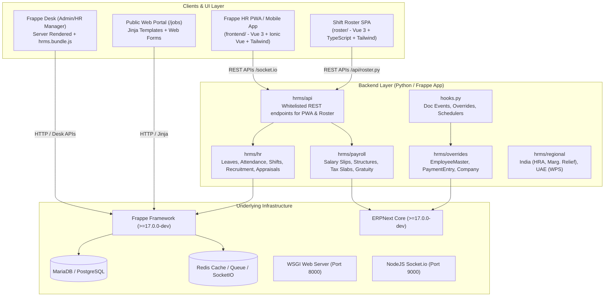

# AGENT CONTEXT: Frappe HRMS (Frappe HR)

This document provides essential context, architectural layout, execution procedures, and structural relationships for AI coding agents and human developers working in this repository.

---

## 1. System Overview & Architecture

Frappe HR is a full-featured, open-source Human Resource Management System (HRMS) and Payroll engine built on top of the **Frappe Framework** (`frappe`) with tight integration into **ERPNext** (`erpnext`).

### High-Level Architecture



---

## 2. Directory Structure & Key Files

| Directory / File | Purpose | Why It Exists |
| :--- | :--- | :--- |
| `hrms/` | Core Python application package | Main backend Frappe application logic. |
| `hrms/hooks.py` | Frappe extension registry | Connects HRMS to Frappe lifecycle (DocType overrides, doc events, schedulers, web routes). |
| `hrms/hr/` | HR domain logic & DocTypes | Implements Leaves, Attendance, Shift management, Recruitment, Appraisal, Onboarding/Separation. |
| `hrms/payroll/` | Payroll calculation & DocTypes | Salary structure assignment, Salary Slip generation, Tax calculations, Gratuity, Bonus. |
| `hrms/api/` | Specialized Whitelisted APIs | REST APIs optimized for the mobile PWA (`/api/__init__.py`) and Shift Roster (`/api/roster.py`). |
| `hrms/overrides/` | Monkey-patches & Subclasses | Extends ERPNext core models (`Employee`, `Company`, `Timesheet`, `Payment Entry`) without modifying upstream files. |
| `hrms/regional/` | Country-specific tax/payroll rules | Encapsulates localized compliance (e.g., Indian Income Tax HRA exemptions, UAE Gratuity/WPS). |
| `hrms/telemetry.py` | Usage telemetry & milestone pulses | Anonymous usage telemetry for feature adoption tracking. |
| `hrms/setup.py` | App installation & migration scripts | Injects custom fields, fixtures, roles, and property setters on installation/migration. |
| `hrms/patches.txt` | Schema migration patches | Ordered execution of data migrations across HRMS versions. |
| `hrms/www/` | Web page endpoints | Serves PWA bootstrap (`hrms.py` -> `/hrms`), Roster (`roster.py` -> `/hr`), and job portal. |
| `frontend/` | Employee Self-Service (ESS) Mobile/PWA | Vue 3 + Ionic Vue + Tailwind CSS + Vite SPA. Built as `/hrms` frontend and hybrid mobile app. |
| `roster/` | Shift Planning & Roster SPA | Vue 3 + TypeScript + Vite interactive calendar/matrix for workforce scheduling at `/hr`. |
| `docker/` | Containerized dev environment | `docker-compose.yml` and `init.sh` for fast one-command setup without local Bench installation. |
| `pyproject.toml` | Python package specification | Defines dependencies (`flit_core`), ruff linter/formatter rules, and frappe version constraints. |
| `package.json` | Monorepo Node build scripts | Coordinates yarn builds for both `frontend` and `roster` SPAs. |

---

## 3. "Why It Is The Way It Is" (Architectural Rationale)

1. **Why DocTypes instead of traditional ORM models (SQLAlchemy/Django)?**
   Frappe uses schema-as-JSON DocTypes. Every DocType automatically gets database tables, automatic CRUD APIs, role-based access control (RBAC), UI forms in Frappe Desk, workflow states, and audit trails (`modified_by`, `creation`).
2. **Why two separate Vue SPAs (`frontend` and `roster`) alongside Frappe Desk?**
   - **Frappe Desk**: Highly customizable, form-heavy, tailored for HR admins and power users.
   - **`frontend` (PWA/Mobile)**: Touch-optimized, mobile-first Employee Self-Service (check-in with geolocation, leave application, expense claims, salary slip viewing).
   - **`roster`**: Complex matrix UI for shift assignments requiring rich interactive drag-and-drop state that Desk form views cannot deliver effectively.
3. **Why `hrms/overrides/`?**
   `Employee`, `Company`, and `Timesheet` exist in `erpnext` or `frappe`. To add HRMS features without fork drift, HRMS overrides these classes via `override_doctype_class` in `hooks.py`.
4. **Why `hrms/setup.py` injects Custom Fields?**
   When HRMS is installed on an ERPNext site, it needs additional fields on ERPNext doctypes (e.g. `Payment Entry`, `Company`). Rather than modifying core doctype definitions, it dynamically injects `Custom Field` records into the database.

---

## 4. How to Run & Start Backend

### Prerequisites
- **Python**: `>=3.10`
- **Node.js**: `>=18` & **Yarn**
- **MariaDB**: `10.6+` (configured with `utf8mb4` character set)
- **Redis**: For cache, queue, and socketio
- **Frappe Bench**: `bench` CLI tool

### Option A: Using Docker (Fastest for testing)
```bash
cd docker
docker-compose up
```
- Access at `http://localhost:8000`
- Login: `Administrator` / `admin`

### Option B: Local Frappe Bench Environment
1. Initialize bench and fetch apps:
   ```bash
   bench init --frappe-branch develop frappe-bench
   cd frappe-bench
   bench get-app erpnext --branch develop
   bench get-app hrms --branch develop  # or link local repo: bench get-app /path/to/hrms
   ```
2. Create site and install HRMS:
   ```bash
   bench new-site hrms.localhost --mariadb-root-password <root_password> --admin-password admin
   bench --site hrms.localhost install-app erpnext
   bench --site hrms.localhost install-app hrms
   bench --site hrms.localhost set-config developer_mode 1
   ```
3. Start backend services:
   ```bash
   bench start
   ```
   *Runs Gunicorn/Werkzeug HTTP on 8000, SocketIO on 9000, Redis on 11000/12000/13000.*

---

## 5. Web UI & Frontend Development

### Monorepo Scripts (`package.json`)
```bash
# Install dependencies for all sub-apps
yarn install

# Run PWA dev server (Port 8080, proxies backend API to port 8000)
yarn dev-pwa

# Run Roster dev server
yarn dev-roster

# Build both production bundles
yarn build
```

### Routing Breakdown
- Desk: `http://<site>:8000/app`
- PWA / Mobile ESS: `http://<site>:8000/hrms` (Routed to `hrms/www/hrms.py` -> `hrms/public/frontend/index.html`)
- Roster: `http://<site>:8000/hr` (Routed to `hrms/www/roster.py` -> `hrms/public/roster/index.html`)
- Job Openings (Public): `http://<site>:8000/jobs`

---

## 6. How the Mobile App is Built (Ionic + Capacitor)

The mobile app codebase is located in `frontend/`. It is structured as an **Ionic Vue** single-page application with PWA and native wrapper capabilities.

### Mobile App Tech Stack
- `@ionic/vue` & `@ionic/vue-router`: Native-feel UI components (Modals, ActionSheets, Tab bars, Transitions).
- `frappe-ui`: Reactive resource fetchers (`createResource`, `frappeRequest`, `call`).
- `vite-plugin-pwa` + `workbox`: Service Worker caching, offline support, and web manifest.
- Geolocation API: For check-in/out location capture (`navigator.geolocation`).

### Native Mobile Build (Android / iOS) via Capacitor
To package `frontend/` into an APK/AAB or iOS app:
1. Navigate to frontend:
   ```bash
   cd frontend
   yarn install
   ```
2. Install Capacitor dependencies:
   ```bash
   yarn add @capacitor/core @capacitor/cli @capacitor/android @capacitor/ios
   ```
3. Initialize Capacitor:
   ```bash
   npx cap init "Frappe HR" "io.frappe.hrms" --web-dir="../hrms/public/frontend"
   ```
4. Add platforms:
   ```bash
   npx cap add android
   npx cap add ios
   ```
5. Build and sync assets:
   ```bash
   yarn build
   npx cap sync
   ```
6. Open in Native IDE:
   ```bash
   npx cap open android   # Launches Android Studio for Gradle build
   npx cap open ios       # Launches Xcode for iOS archive build
   ```

---

## 7. Important Coding Guidelines for Agents

1. **Never write raw SQL queries when QueryBuilder or `frappe.db` methods suffice.** Use `frappe.db.get_value()`, `frappe.db.get_all()`, or `frappe.qb`.
2. **Permissions:** All custom API methods meant to be accessed via HTTP must have `@frappe.whitelist()`. Always check user roles or validate employee ownership using `get_current_employee()`.
3. **DocType Hooks:** Always check `hrms/hooks.py` before creating new lifecycle hooks or background cron jobs.
4. **Localization:** Wrap user-facing error and message strings in `_("Your message")` or `frappe._()`.
5. **Linting & Formatting:** Adhere to Ruff configs specified in `pyproject.toml` (tab indentation, double quotes, line length 110). Run `ruff check .` and `ruff format .`.
