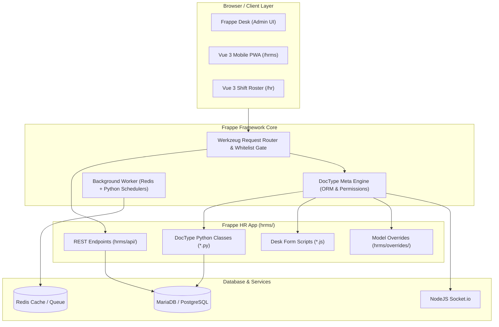

# Frappe Framework & Frappe HR: Complete Team Onboarding & Developer Guide

Welcome to the team! This guide explains how the **Frappe Framework** works, how the **Frappe HR (HRMS)** codebase is organized, what all the files do, and how you can start developing features immediately without breaking the system.

---

## 1. What is Frappe Framework?

Frappe is a full-stack, metadata-driven web framework written in Python and JavaScript. Unlike traditional web frameworks (like Django, Rails, or Laravel) where you write database migrations, models, API endpoints, and admin UI views manually from scratch:

* **Metadata-Driven (DocTypes):** In Frappe, everything is a **DocType** (Document Type). A DocType defines both the database table schema, API permissions, and form layout inside a single JSON file.
* **Batteries-Included:** Frappe automatically handles authentication, Role-Based Access Control (RBAC), database migrations, REST APIs, audit trails (`creation`, `modified_by`), and admin forms (Frappe Desk).
* **Multi-Tenancy (Bench):** A single Frappe server can host multiple isolated sites with their own databases (`hrms.localhost`, `site2.local`) sharing common application code.



---

## 2. Anatomy of a Frappe App: What All the Files Mean

When looking at the repository, you will see many `.json`, `.js`, `.py`, and `.txt` files. Here is what each file type does and why it exists:

### 2.1. File Structure of a Single DocType (`hrms/hr/doctype/leave_application/`)

Every DocType lives in its own folder and contains a standardized set of files:

| File Name | Purpose | Can it be deleted? |
| :--- | :--- | :--- |
| `leave_application.json` | **Database Schema & Form Layout.** Defines all fields, types (Data, Link, Currency), tables, and permission rules. Frappe reads this file to auto-create SQL tables. | ❌ **CRITICAL: NEVER DELETE** |
| `leave_application.py` | **Server-Side Controller.** Python class inheriting from `Document`. Contains business logic (`validate`, `before_save`, `on_submit`, `on_cancel`). | ❌ **CRITICAL: NEVER DELETE** |
| `leave_application.js` | **Client-Side Desk Controller.** Runs in the browser on Frappe Desk. Handles form events, field triggers, button actions, and dynamic filtering. | ❌ **CRITICAL: NEVER DELETE** |
| `test_leave_application.py`| **Unit Tests.** Python test suite executed by `bench run-tests`. | ❌ Recommended to keep |
| `leave_application_list.js`| **List View Settings.** Customizes status color badges and list indicators in Desk. | ❌ Keep if present |

### 2.2. Critical System Files in `hrms/`

* **`hrms/hooks.py`**: The heart of the app. Configures routing, doctype overrides, background schedulers, custom document events, desktop icons, and regional overrides.
* **`hrms/modules.txt`**: Plaintext list registering the app's internal modules (`HR`, `Payroll`). Frappe engine fails to load the app if this is missing.
* **`hrms/patches.txt`**: Database migration log. Lists Python patch scripts that must execute sequentially during `bench migrate`.
* **`hrms/setup.py`**: Runs post-installation routines (injects custom fields into ERPNext, sets default fixtures, creates role profiles).
* **`hrms/api/`**: Custom whitelisted REST endpoints for the mobile PWA and shift roster.

### 2.3. Frontend SPAs (`frontend/` & `roster/`)

* **`frontend/`**: Modern Employee Self-Service (ESS) built with **Vue 3**, **Ionic Vue**, **Tailwind CSS**, and **Frappe UI**. It is compiled by Vite and served at `/hrms`.
* **`roster/`**: Interactive workforce shift management grid built with **Vue 3**, **TypeScript**, and **Tailwind CSS**. Served at `/hr`.

---

## 3. Safe vs. Unsafe File Deletions

If you are looking to clean up the workspace, reference this table:

### ❌ DO NOT DELETE (App will break)
* Any `*.json` inside `hrms/hr/doctype/` or `hrms/payroll/doctype/`
* Any `*.js` inside `hrms/hr/doctype/` or `hrms/payroll/doctype/`
* `hrms/hooks.py`, `hrms/setup.py`, `hrms/modules.txt`, `hrms/patches.txt`
* `hrms/overrides/`, `hrms/api/`, `hrms/regional/`
* `frontend/src/` and `roster/src/`

### ✅ SAFE TO DELETE (Optional / Developer Utilities Only)
* **CI / Bot Configs:** `.github/`, `.mergify.yml`, `.releaserc`, `.pre-commit-config.yaml`, `codecov.yml`, `crowdin.yml`, `commitlint.config.js`, `.git-blame-ignore-revs`, `semgrep/`, `.semgrepignore`
* **Editor Configs:** `.editorconfig`, `frontend/.eslintrc.js`, `frontend/.prettierrc.json`
* **Open Source Policies:** `CODE_OF_CONDUCT.md`, `SECURITY.md`, `hrms/hr/README.md`
* **Repository Artwork:** `hrms.png` and `hrms/hrms.png`

---

## 4. How to Write Code in Frappe: Core Patterns

### 4.1. Server-Side: Python Controllers (`Document` Lifecycle)

When creating or modifying a DocType controller, implement lifecycle methods:

```python
import frappe
from frappe import _
from frappe.model.document import Document
from frappe.utils import getdate, date_diff

class LeaveApplication(Document):
    def validate(self):
        """Runs on EVERY save (Draft or Submit). Use for validation."""
        self.validate_dates()
        self.calculate_total_leave_days()

    def before_submit(self):
        """Runs immediately before document is submitted."""
        self.check_leave_balance()

    def on_submit(self):
        """Runs after document is submitted (DocStatus = 1). Update ledgers."""
        self.create_leave_ledger_entry(status="Submitted")

    def on_cancel(self):
        """Runs when document is cancelled (DocStatus = 2). Reverse ledgers."""
        self.create_leave_ledger_entry(status="Cancelled")

    def validate_dates(self):
        if getdate(self.from_date) > getdate(self.to_date):
            frappe.throw(_("To Date cannot be before From Date"))
```

### 4.2. Server-Side: Database Operations Cheat Sheet

```python
import frappe

# 1. Fetch single field or dictionary from database (Fastest, does not trigger controller hooks)
employee_name = frappe.db.get_value("Employee", "HR-EMP-00001", "employee_name")
data = frappe.db.get_value("Employee", {"user_id": frappe.session.user}, ["name", "department"], as_dict=True)

# 2. Fetch list of records
active_employees = frappe.get_all(
    "Employee",
    filters={"status": "Active", "company": "Frappe Technologies"},
    fields=["name", "employee_name", "department"],
    order_by="employee_name asc",
    limit=50
)

# 3. Fetch full Document instance (Use when you need methods or need to save)
doc = frappe.get_doc("Leave Application", "LEAV-APP-2026-0001")
doc.status = "Approved"
doc.save() # or doc.submit()

# 4. Create new Document
new_checkin = frappe.get_doc({
    "doctype": "Employee Checkin",
    "employee": "HR-EMP-00001",
    "log_type": "IN",
    "time": frappe.utils.now_datetime()
})
new_checkin.insert()
```

### 4.3. Creating Whitelisted API Endpoints

To expose a Python function to the frontend or mobile app via HTTP:

```python
import frappe

@frappe.whitelist()
def get_employee_balance(employee: str, leave_type: str) -> dict:
    # Security check: Ensure user is logged in
    if frappe.session.user == "Guest":
        frappe.throw("Authentication required", frappe.AuthenticationError)

    # Business logic
    balance = hrms.hr.utils.get_leave_balance(employee, leave_type)
    return {"employee": employee, "balance": balance}
```
*Frontend URL to call this:* `/api/method/hrms.api.get_employee_balance?employee=HR-EMP-00001&leave_type=Casual Leave`

### 4.4. Client-Side: Frappe Desk Form Scripts (`*.js`)

To control Desk UI behaviour:

```javascript
frappe.ui.form.on("Leave Application", {
    refresh(frm) {
        // Runs when form loads
        if (frm.doc.docstatus === 1 && frm.doc.status === "Approved") {
            frm.add_custom_button(__("View Ledger"), () => {
                frappe.set_route("List", "Leave Ledger Entry", {
                    transaction_name: frm.doc.name
                });
            });
        }
    },

    leave_type(frm) {
        // Triggered when 'leave_type' field changes
        if (frm.doc.leave_type && frm.doc.employee) {
            frappe.call({
                method: "hrms.api.get_employee_balance",
                args: {
                    employee: frm.doc.employee,
                    leave_type: frm.doc.leave_type
                },
                callback: function(r) {
                    if (r.message) {
                        frm.set_value("leave_balance", r.message.balance);
                    }
                }
            });
        }
    }
});
```

---

## 5. Daily Developer Commands (Cheat Sheet)

Run these inside your `frappe-bench/` directory:

| Command | What it does |
| :--- | :--- |
| `bench start` | Starts Gunicorn web server, Socket.IO, Redis, and Celery/RQ workers. |
| `bench migrate` | Runs new patches from `patches.txt` and syncs DocType JSON schemas with DB. |
| `bench build --app hrms` | Compiles Desk JavaScript/CSS bundles (`hrms.bundle.js`). |
| `bench --site [site-name] console` | Opens an interactive Python shell with the site database loaded. |
| `bench --site [site-name] clear-cache` | Clears Redis cache and doctype schema cache. |
| `bench --site [site-name] run-tests --app hrms` | Executes the automated test suite for HRMS. |
| `bench --site [site-name] execute [path.to.function]` | Runs any Python function from CLI with site context. |

---

## 6. Development Workflow for New Features

1. **Pull Latest Changes:**
   ```bash
   git pull
   bench migrate
   ```
2. **If editing Frappe Desk / Backend:**
   * Modify Python controller (`*.py`) or Client script (`*.js`).
   * Schema changes? Make changes in Frappe Desk UI in Developer Mode (`developer_mode: 1`), and Frappe will auto-update the DocType JSON file.
3. **If editing Mobile PWA / Frontend:**
   * `cd frontend && yarn dev` (runs hot-reload server at `http://localhost:8080`).
4. **If editing Shift Roster:**
   * `cd roster && yarn dev` (runs at `http://localhost:5173`).
5. **Run tests and linting:**
   * `bench --site [site-name] run-tests --app hrms`
   * `ruff check .` and `ruff format .`
